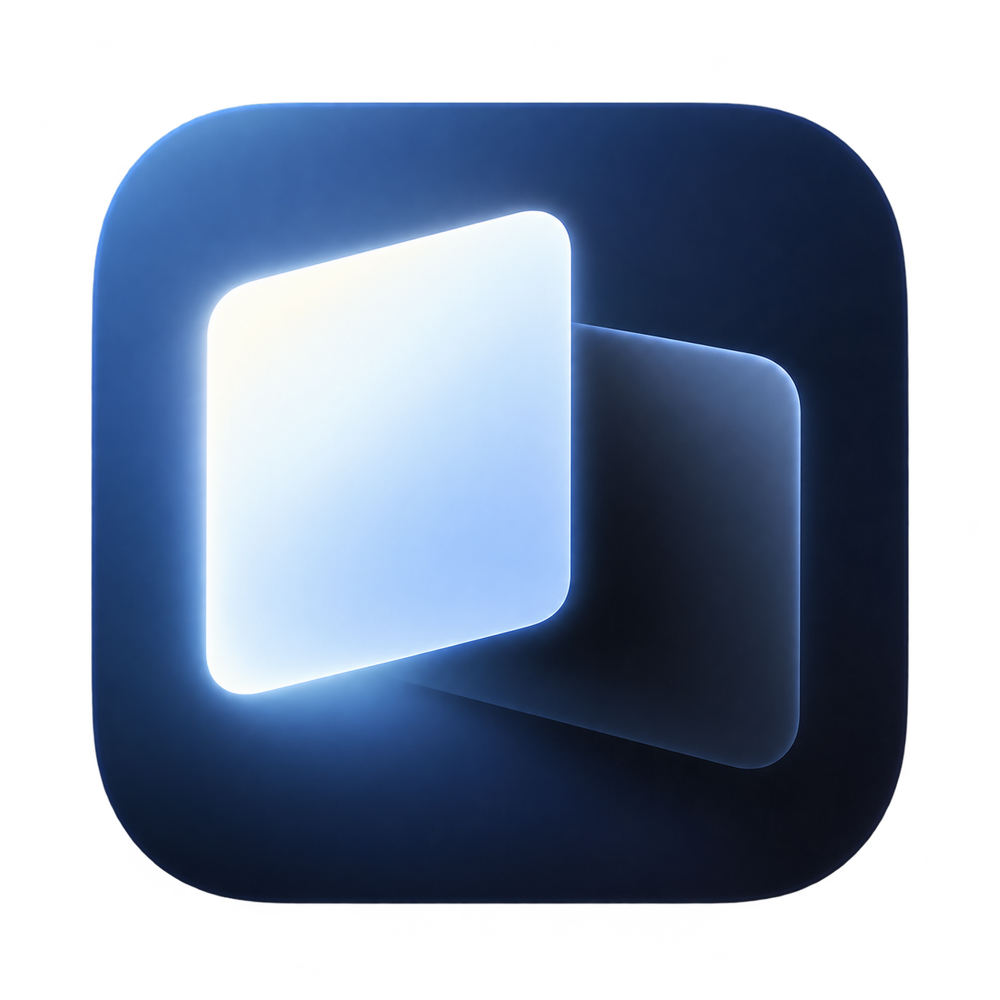

# Screen Toggle



A standalone menu-bar app for switching a Mac's built-in display on and off while an external monitor is connected. No Lunar installation, Pro activation, network service, or third-party dependency is required.

## Use

Open `build/Screen Toggle.app`. Click the laptop icon in the menu bar, then **Turn Built-in Display Off**. Use the same menu on the external display to turn it back on.

- **Control–Option–Command–B:** toggle the built-in display.
- **Control–Option–Command–R:** restore the built-in display.
- Turning the display off requires an active external monitor.
- On a display-change event, the app enables an off built-in display whenever no external display is available, even if another app turned it off. It also checks this condition at launch and on wake.
- The app requests restoration of displays it disabled before sleep and when quitting. macOS also reverts app-scoped display configuration when the process exits.
- If another app has reserved a shortcut, it will be absent from the menu; the menu actions remain available.

This performs a display disconnect, so macOS can move windows onto the external monitor. It does not place a black window over the built-in screen. macOS manages window placement when reconnecting; exact previous window positions are not saved.

## Build

Requires Xcode or Apple Command Line Tools:

```sh
bash build.sh
```

The output is an ad-hoc signed universal app at `build/Screen Toggle.app`, containing both Intel (`x86_64`, also called `amd64`) and Apple Silicon (`arm64`) executables. Copy it to Applications if desired. The app targets macOS 12 Monterey and newer, matching Lunar 6.11.0's minimum macOS version. Download `ScreenToggle-1.0.1-macos-universal.zip` from the [latest release](https://github.com/0xruth1ezz/screen-toggle/releases/latest) for either architecture.

Hardware display behavior has not been tested on either architecture, including macOS 12 and macOS 27. Display disconnection relies on a private API whose behavior can differ between Intel and Apple Silicon Macs.

The build reads its minimum deployment version from `LSMinimumSystemVersion` in `Info.plist`, keeping the executable and app bundle requirements in sync.

## Implementation and sources

Display discovery and automatic restoration are based on the approach visible in Lunar's `Lunar/Utils/DisplayController.swift` and `Lunar/Data/Display.swift`. Lunar's actual BlackOut/disconnect implementation is encrypted in this checkout, so this app implements its own display configuration transaction and does not compile Lunar's encrypted sources or licensing code.

The disconnect operation uses the private macOS `SLSConfigureDisplayEnabled` API, with a `CGSConfigureDisplayEnabled` symbol fallback. `SLSGetDisplayList` locates panels omitted by the public online list after disconnecting. These symbols are loaded dynamically: an unavailable API leaves the app launchable with its toggle disabled. The minimum OS requirement permits launch; display disconnection still depends on the private API working on that hardware and OS version.

- [Lunar](https://github.com/alin23/Lunar): original project; its MIT license is included.
- [displaytoggle API declarations](https://github.com/calvincchan/displaytoggle/blob/main/Sources/displaytoggle/SkyLightBridge.h): reference for private function signatures. This app contains an independent implementation.
- [Apple display configuration lifetime](https://developer.apple.com/documentation/coregraphics/cgconfigureoption/forapponly): configuration changes are scoped to the app process, rather than saved permanently.

Compilation produces the app; no automated tests, app launches, or hardware display toggles were performed during creation.
